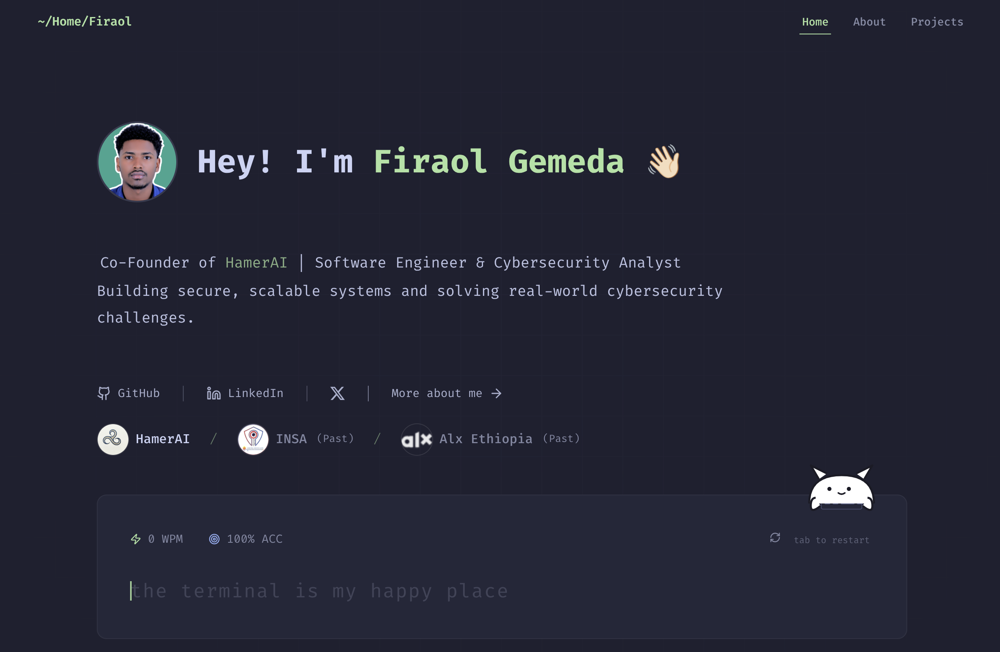

# K9ine95

K9ine95 is my personal digital playground and the third iteration of my portfolio, designed to showcase my projects, experiments, and journey in the world of software development.

## Inspirations
This portfolio project draws inspiration from the design principles and layout style used by Jason Cameron

Thank you for visiting — and please leave a ⭐ if you likey!
